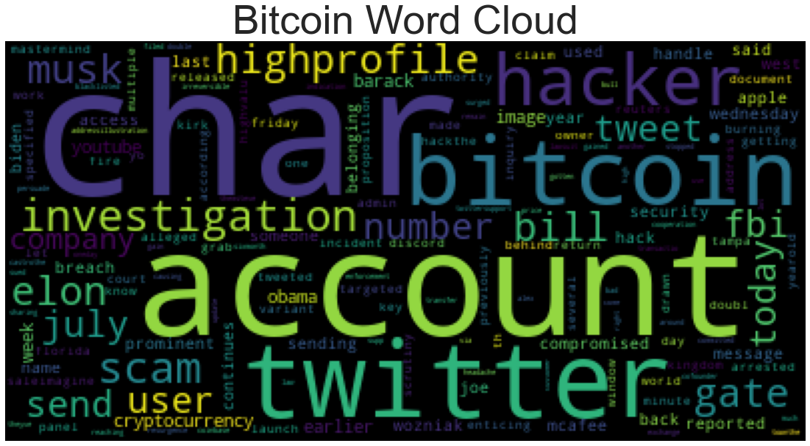

## Background

There's been a lot of hype in the news lately about cryptocurrency, so you want to take stock, so to speak, of the latest news headlines regarding Bitcoin and Ethereum to get a better feel for the current public sentiment around each coin.

I applied natural language processing to understand the sentiment in the latest news articles featuring Bitcoin and Ethereum. I also applied fundamental NLP techniques to better understand the other factors involved with the coin prices such as common words and phrases and organizations and entities mentioned in the articles.

### Files

[Crypto Sentiment](crypto_sentiment.ipynb)

- - -
### Brief Summary of Findings

I used the [newsapi](https://newsapi.org/) to pull the latest news articles for Bitcoin and Ethereum and create a DataFrame of sentiment scores for each coin and to answer the following questions:

Which coin had the highest mean positive score?
- Ethereum

Which coin had the highest negative score?
- Ethereum

Which coin had the highest positive score?
- Ethereum

### Resources

[Vader Sentiment Analysis](http://www.nltk.org/howto/sentiment.html)

